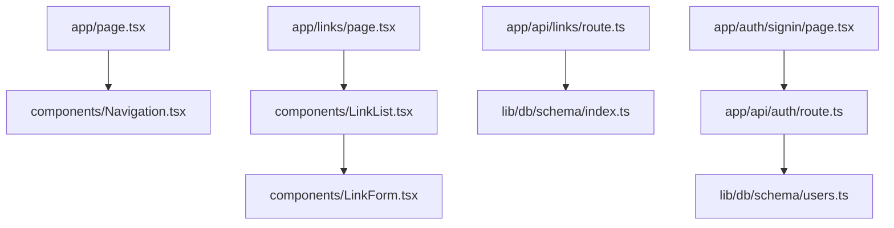

# Navigation Index - LINK Application

## 📍 Quick Navigation

### Development Resources
- [`PROJECT_INDEX.md`](../PROJECT_INDEX.md) - Complete project overview
- [`CLAUDE.md`](../CLAUDE.md) - Claude Code development guidance  
- [`README.md`](../README.md) - Basic setup instructions
- [`GOOGLE_OAUTH_SETUP.md`](../GOOGLE_OAUTH_SETUP.md) - OAuth configuration

### Core Documentation
- [Database Schema](#database-schema) - Complete table structure
- [API Reference](#api-reference) - Endpoint documentation
- [Component Library](#component-library) - UI component catalog
- [Development Workflow](#development-workflow) - Setup and commands

---

## 🗂️ File System Navigation

### Application Structure
```
📂 app/
├── 📄 layout.tsx              # Root application layout
├── 📄 page.tsx                # Homepage component  
├── 📁 auth/                   # Authentication pages
│   ├── 📄 signin/page.tsx     # Login page
│   ├── 📄 signup/page.tsx     # Registration page
│   └── 📄 forgot-password/page.tsx # Password reset
├── 📁 admin/                  # Admin dashboard
│   └── 📄 page.tsx            # User management
├── 📁 links/                  # Link management
│   └── 📄 page.tsx            # Link listing/creation
├── 📁 todo/                   # Task management
│   └── 📄 page.tsx            # Todo interface
├── 📁 prompts/                # Prompt management
│   └── 📄 page.tsx            # Prompt editor
├── 📁 youtube/                # YouTube integration
│   └── 📄 page.tsx            # Video management
└── 📁 api/                    # API endpoints
    ├── 📁 auth/               # Authentication API
    ├── 📁 links/              # Link CRUD operations
    ├── 📁 admin/              # Admin operations
    ├── 📁 ai/                 # AI integration
    └── 📁 upload/             # File upload handling
```

### Database Layer
```
📂 lib/db/
├── 📄 index.ts                # Database connection
└── 📁 schema/
    ├── 📄 index.ts            # Links table schema
    ├── 📄 users.ts            # User authentication
    ├── 📄 ideas.ts            # Ideas management
    ├── 📄 projects.ts         # Project organization
    ├── 📄 tasks.ts            # Task tracking
    └── 📄 todo.ts             # Todo functionality
```

### Component Library
```
📂 components/
├── 📁 ui/                     # Base UI components
│   ├── 📄 button.tsx          # Button variants
│   ├── 📄 card.tsx            # Card containers
│   └── 📄 badge.tsx           # Status badges
├── 📄 LinkForm.tsx            # Link creation/editing
├── 📄 LinkList.tsx            # Link display grid
├── 📄 IdeaForm.tsx            # Ideas management
├── 📄 TodoList.tsx            # Task tracking
├── 📄 ImageDropzone.tsx       # File upload area
├── 📄 ImageViewer.tsx         # Image display
├── 📄 Navigation.tsx          # Site navigation
├── 📄 Toast.tsx               # Notifications
└── 📄 VideoCard.tsx           # YouTube video cards
```

---

## 🔗 Cross-References

### Feature Mapping
| Feature | Pages | API Routes | Components | Database |
|---------|-------|------------|------------|----------|
| **Link Management** | `app/links/page.tsx` | `app/api/links/` | `LinkForm`, `LinkList` | `links` table |
| **Authentication** | `app/auth/` | `app/api/auth/` | `user-menu` | `users` table |
| **Task Management** | `app/todo/page.tsx` | `app/api/ideas/` | `TodoList` | `todos`, `tasks` |
| **AI Integration** | `app/prompts/page.tsx` | `app/api/ai/` | `PromptForm` | N/A |
| **File Upload** | Multiple | `app/api/upload/` | `ImageDropzone` | Binary data |
| **Admin Panel** | `app/admin/page.tsx` | `app/api/admin/` | Custom | `users` table |

### Dependency Relationships


---

## 📊 Database Schema Reference

### Table Relationships
```sql
-- Primary entities and their relationships
users (1) --> (*) links        -- User owns multiple links
users (1) --> (*) todos         -- User has multiple todos  
users (1) --> (*) ideas         -- User creates multiple ideas
projects (1) --> (*) tasks      -- Project contains multiple tasks
```

### Schema Files
- [`lib/db/schema/index.ts`](../lib/db/schema/index.ts) - Links table (primary entity)
- [`lib/db/schema/users.ts`](../lib/db/schema/users.ts) - User management
- [`lib/db/schema/ideas.ts`](../lib/db/schema/ideas.ts) - Ideas tracking
- [`lib/db/schema/projects.ts`](../lib/db/schema/projects.ts) - Project organization
- [`lib/db/schema/tasks.ts`](../lib/db/schema/tasks.ts) - Task management
- [`lib/db/schema/todo.ts`](../lib/db/schema/todo.ts) - Todo functionality

---

## 🛠️ API Reference

### Authentication Endpoints
```
POST /api/auth/register         # User registration
POST /api/auth/signin          # User login  
POST /api/auth/forgot-password # Password reset
POST /api/auth/reset-password  # Password update
GET  /api/auth/[...nextauth]   # NextAuth handlers
```

### Core Entity Endpoints
```
# Link Management
GET    /api/links             # List all links
POST   /api/links             # Create new link
GET    /api/links/[id]        # Get specific link
PUT    /api/links/[id]        # Update link
DELETE /api/links/[id]        # Delete link
GET    /api/links/[id]/thumbnail # Get thumbnail

# Ideas & Tasks
GET    /api/ideas             # List ideas
POST   /api/ideas             # Create idea
GET    /api/ideas/[id]        # Get specific idea
PUT    /api/ideas/[id]        # Update idea

# Admin Operations
GET    /api/admin/users       # List users (admin only)
POST   /api/admin/update-user-role # Update user role
```

### Utility Endpoints
```
POST /api/upload              # File upload
POST /api/ai                  # AI content generation
GET  /api/health              # Health check
POST /api/migrate             # Database migration
```

---

## 🎨 Component Library

### UI Components (`components/ui/`)
- **Button** (`button.tsx`) - Primary, secondary, destructive variants
- **Card** (`card.tsx`) - Container with header, content, footer
- **Badge** (`badge.tsx`) - Status indicators and tags

### Feature Components
- **LinkForm** (`LinkForm.tsx`) - Create/edit links with validation
- **LinkList** (`LinkList.tsx`) - Grid display of links with actions  
- **TodoList** (`TodoList.tsx`) - Task management with CRUD operations
- **IdeaForm** (`IdeaForm.tsx`) - Ideas creation and editing
- **ImageDropzone** (`ImageDropzone.tsx`) - Drag-and-drop file uploads
- **Navigation** (`Navigation.tsx`) - Site-wide navigation menu
- **Toast** (`Toast.tsx`) - Notification system

### App-Level Components (`app/components/`)
- **Header** (`Header.tsx`) - Application header
- **TodoList** (`TodoList.tsx`) - Page-specific todo component
- **user-menu** (`user-menu.tsx`) - User authentication menu

---

## 🔧 Development Workflow

### Quick Start Commands
```bash
# Setup
npm install                   # Install dependencies
npm run db:setup             # Initialize database

# Development  
npm run dev                  # Start dev server (port 9999)
npm run lint                 # Code linting
npm test                     # Run tests

# Database Operations
npm run db:studio            # Open Drizzle Studio
npm run db:generate          # Generate migrations
npm run db:push              # Apply migrations
npm run db:seed              # Seed database
```

### File Modification Workflow
1. **Schema Changes**: Update `lib/db/schema/` → `npm run db:generate` → `npm run db:push`
2. **API Changes**: Modify `app/api/` → Test with curl → Update types
3. **UI Changes**: Update components → Test in browser → Lint
4. **Page Changes**: Modify `app/*/page.tsx` → Test navigation → Validate

---

## 🔍 Search and Discovery

### Finding Components
```bash
# Search for specific functionality
grep -r "useState" app/           # Find state usage
grep -r "database" lib/           # Find database references  
find . -name "*Form*"             # Find form components
find . -name "*api*" -type d      # Find API directories
```

### Key Search Patterns
- **Database**: Search `lib/db/schema/` for table definitions
- **API Routes**: Look in `app/api/` for endpoint implementations  
- **Components**: Check `components/` for reusable UI elements
- **Pages**: Find in `app/*/page.tsx` for route implementations
- **Types**: Search for `*.ts` files for TypeScript definitions

---

## 🚨 Important Locations

### Configuration Files
- `package.json` - Dependencies and scripts
- `next.config.js` - Next.js configuration  
- `drizzle.config.ts` - Database configuration
- `tailwind.config.ts` - Styling configuration
- `tsconfig.json` - TypeScript configuration

### Environment Setup
- `.env` - Environment variables (not in repo)
- `docker-compose.yml` - Container configuration
- `Dockerfile` - Container build instructions

### Development Tools
- `__tests__/` - Test files and setup
- `scripts/` - Database and deployment scripts
- `logs/` - Application logs
- `public/uploads/` - Uploaded file storage

---

*This navigation index is automatically maintained and cross-referenced with the main project documentation.*